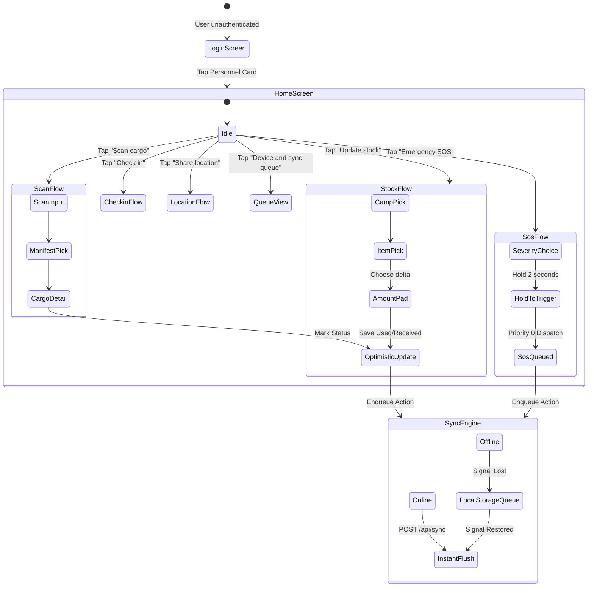

# Deep Frontend & HTML Analysis: POLAR-OPS

**Project:** POLAR-OPS (Smart India Hackathon 2026 · PS 26062)  
**Evaluated Codebase:** `index.html`, `styles.css`, `polar-ops.js`, `qrcode-generator.js`  
**Date:** October 2026  
**Auditor:** Frontend Engineering & UX Architecture Lead

---

## 1. Executive Summary & Inventory

The project is an **offline-first dual-interface expedition dashboard and rugged tablet simulator** for the Ministry of Earth Sciences (MoES) / NCPOR Antarctic Scientific Expeditions.

### File Inventory
| File Name | Size (Bytes) | Role / Content |
| :--- | :---: | :--- |
| `index.html` | ~9.2 KB | Single-page layout containing top bar, dual-column split view (Dashboard + Tablet), and modal sheets. |
| `styles.css` | ~25.9 KB | Dark polar-night theme (`--night`, `--shelf`, `--signal`, etc.), responsive grid, print styles for labels. |
| `polar-ops.js` | ~69.2 KB | Complete frontend runtime: client-side state store, sync queue, MRS score engine, SVG map projector, audio synthesizer, DOM binders. |
| `qrcode-generator.js` | ~56.7 KB | MIT-licensed standalone client-side SVG QR code generation library by Kazuhiko Arase. |

---

## 2. Page Structure & DOM Tree Breakdown

The visual document is organized into three primary layers:
1. **Header (`<header class="top">`)**:
   - Brand lockup: Polar SVG emblem, application title (`POLAR-OPS`), and SIH mission subtitle.
   - Persona switcher: `<select id="acting">` toggling between *Dr. Anjali Rao (Expedition Leader)* and *Dr. Vikram Menon (Medical Officer)*.
   - Audio controller: `<button id="mute">` (toggles 880Hz audio alarm).
   - State reset: `<button id="reset">` (resets browser `localStorage` back to seed dataset).
   - Judge Walkthrough Strip (`
`): Horizontal milestone stepper (`<ol id="tour-steps">`) tracking 8 interactive evaluation milestones.
   - Viewport view toggle (`
`): Responsive buttons (`show-both`, `show-dash`, `show-field`) visible on screens $\le 1050\text{px}$.
2. **Main Stage (`<main class="stage" id="stage">`)**:
   - **Left Column (`<section class="dash">`)**:
     - `#sos-banner`: Emergency broadcast banner with pulse animation and Ack/Resolve triggers.
     - `#kpis`: 6-card high-level metric grid (Personnel, Overdue, Delivered/Total, In Transit, Delayed/Missing, Active SOS).
     - Navigation tab strip (`<nav class="tabs">`): Tabs for `Command Centre`, `Cargo & QR`, `Stock & Thresholds`, `Personnel & Comms`, and `Expedition Plan`.
     - Sub-views (`.view`):
       - `#v-command`: Antarctic SVG projection map with graticules + Mission Readiness Score circular gauge + Alerts panel + Camp cards + Activity stream.
       - `#v-cargo`: Cargo registration form + filterable cargo manifest table + label printing.
       - `#v-stock`: Camp-wise stock gauges with editable emergency alert threshold inputs.
       - `#v-people`: Personnel onboarding form + active roster table + tablet comms status + SOS history log.
       - `#v-plan`: Interactive Antarctic route waypoint plotter with drag/toggle reordering.
   - **Right Column (`<aside class="phone-col">`)**:
     - Phone housing (`.phone`) simulating a rugged field tablet (screen wrap: $410\text{px} \times 720\text{px}$).
     - Top telemetry bar (`#netbar`): Connection indicator dot, pending sync badge, and signal toggle button (`Lose signal` / `Restore signal`).
     - Dynamic screen container (`#fbody`): Swaps screens across `login`, `home`, `scan`, `asset`, `checkin`, `stock`, `amount`, `location`, `sos`, and `queue`.
     - Device toast notification overlay (`#ftoast`).
3. **Overlays & Utilities**:
   - `#print-sheet`: Hidden print layout rendered on demand with CSS `@media print` for barcode label rolls.
   - `#toasts`: Fixed bottom-left command notification stack.

---

## 3. UI Component Taxonomy

| Component Class / ID | HTML Element | Function & Interactive Behavior |
| :--- | :--- | :--- |
| `.ring` / `#readiness` | SVG Circle + Text | 120px circular gauge with dynamic SVG `stroke-dashoffset` animation displaying the 0-100% Mission Readiness Score and score delta (+/-). |
| `#map` / `#plan-map` | SVG `<svg>` | Mathematical Antarctic polar projection with coordinate graticule grid, route polylines, station rhombuses, and pulsating crew beacons. |
| `.hold` / `#hold` | SVG Radial Button | 2-second hold-to-activate emergency SOS button with radial sweep circle animation (`stroke-dashoffset: 0`) and vibration API triggers. |
| `.gauge` | Div + `<i style="width: %">` | Horizontal stock gauge bar with absolute alert threshold notch indicator. |
| `.srow` | Form Row | Stock item row with real-time numeric threshold input (`<input type="number" data-thr="...">`). |
| `.tile` | Large Touch Card | High-contrast, tactile $112\text{px}$ touch tiles for glove-friendly field navigation. |
| `.pad` / `.amt` | Button Steppers | Numeric steppers (`+5`, `+10`, `+25`, `+50`, `+`, `-`) for fast sub-zero stock logging. |
| `.seg` | Button Segment | Segmented switch control for map filters and cargo manifest status filters. |

---

## 4. User Flows & State Transitions

---

## 5. Styling System & Visual Design Tokens

The styling is defined in `styles.css` using custom CSS properties with a custom **Polar-Night** palette:

* **Backgrounds & Surfaces**:
  * `--night`: `#0c1826` (Deep sub-polar abyss background)
  * `--shelf`: `#13243a` (Primary card / panel background)
  * `--shelf-2`: `#1a3150` (Secondary button / control surface)
  * `--ridge`: `#24405f` (Divider and structural border color)
* **Text & Typography**:
  * `--ice`: `#e4edf5` (Primary crisp white text)
  * `--frost`: `#8da3ba` (Muted secondary meta label text)
  * `--font`: `"Segoe UI", "Noto Sans", Roboto, "Helvetica Neue", Arial, sans-serif`
  * Tabular numeric alignment enabled globally: `font-variant-numeric: tabular-nums`
* **Status & Telemetry Accents**:
  * `--signal`: `#ff8a1f` (Primary active action amber/orange)
  * `--ok`: `#3cb67b` (Success, delivered, connected emerald green)
  * `--warn`: `#e9b63b` (Overdue, delayed, warning gold)
  * `--sos`: `#f04444` (Critical alarm, out-of-stock, emergency crimson)
  * `--transit`: `#5aa9e6` (Cargo in transit, ice blue)

---

## 6. JavaScript Event Handling & DOM Architecture

* **Encapsulation**: Code runs inside a self-invoking function `(function () { "use strict"; ... })()`.
* **DOM Selectors**: Light micro-helpers `$` (`querySelector`) and `$$` (`querySelectorAll`).
* **State Management**:
  * `srv`: Server state object (camps, route, people, cargo, inv, alerts, sos, activity, devices, processed).
  * `fld`: Field device state (user, boot, queue, offline, everOffline, lastSync).
  * Persisted transparently into browser `localStorage.setItem('polarops-demo-v1', ...)` on every mutation.
* **Audio Synthesis**: Native Web Audio API `AudioContext` generating square-wave double-beep alerts at 880Hz during active emergencies.

---

## 7. Frontend Issues & Technical Observations

1. **Monolithic Scripting**: `polar-ops.js` is over 1,000 lines, bundling server simulation, data models, math projection, SVG rendering, audio synthesizer, and field tablet routing into a single file.
2. **Hardcoded HTML in Template Strings**: Views are constructed via template literal interpolation (`innerHTML = ...`). While sanitization helper `esc()` is used, this makes UI refactoring and component reusability difficult.
3. **No Component Separation**: Dashboard cards, table rows, and tablet screens are tightly coupled with global state variables.
4. **CSS Print Rules**: Print styling targets `#print-sheet` nicely, but could be enhanced with page-break controls for multiple thermal badge sizes.
5. **Accessibility Gaps**: Several button icons lack `aria-label` tags, and the canvas/SVG map lacks keyboard navigation markers.

---

## 8. Improvement Opportunities

* **Component-Oriented Organization**: Structure UI templates into clean, modular rendering methods.
* **Accessible Screen Readers**: Add `aria-live="assertive"` to the emergency SOS container and `#toasts` notifications.
* **PWA Readiness**: Introduce a lightweight Web App Manifest (`manifest.json`) and Service Worker for true standalone offline caching on mobile hardware.
* **Enhanced Visual Cartography**: Add zoom/pan controls to the Antarctic SVG map projector.
